[TOC]

# 黑马 - Arthas - 基础

# 概述

## Arthas（阿尔萨斯） 能为你做什么？

 

`Arthas` 是Alibaba开源的Java诊断工具，深受开发者喜爱。

当你遇到以下类似问题而束手无策时，`Arthas`可以帮助你解决：

1. 这个类从哪个 jar 包加载的？为什么会报各种类相关的 Exception？
2. 我改的代码为什么没有执行到？难道是我没 commit？分支搞错了？
3. 遇到问题无法在线上 debug，难道只能通过加日志再重新发布吗？
4. 线上遇到某个用户的数据处理有问题，但线上同样无法 debug，线下无法重现！
5. 是否有一个全局视角来查看系统的运行状况？
6. 有什么办法可以监控到JVM的实时运行状态？
7. 怎么快速定位应用的热点，生成火焰图？

## 运行环境要求

`Arthas`支持JDK 6+，支持Linux/Mac/Windows，采用命令行交互模式，同时提供丰富的 `Tab` 自动补全功能，进一步方便进行问题的定位和诊断。


# 快速安装

下载`arthas-boot.jar`，然后用`java -jar`的方式启动：

## 命令

```
curl -O https://alibaba.github.io/arthas/arthas-boot.jar
java -jar arthas-boot.jar
```

注：在运行第2条命令之前，先运行一个java进程在内存中，不然会出现找不到java进程的错误。

打印帮助信息

```
java -jar arthas-boot.jar -h
```

如果下载速度比较慢，可以使用aliyun的镜像：

```
java -jar arthas-boot.jar --repo-mirror aliyun --use-http
```


## Windows下安装

1. 在c:\下创建目录arthas，在windows命令窗口下，使用curl命令下载阿里服务器上的jar包，大小108k

   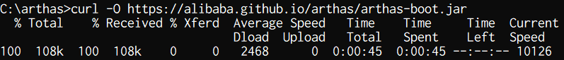 

   

2. 使用java启动arthas-boot.jar，来安装arthas，大小约10M。运行此命令会发现java进程，输入1按回车。则自动从远程主机上下载arthas到本地目录

   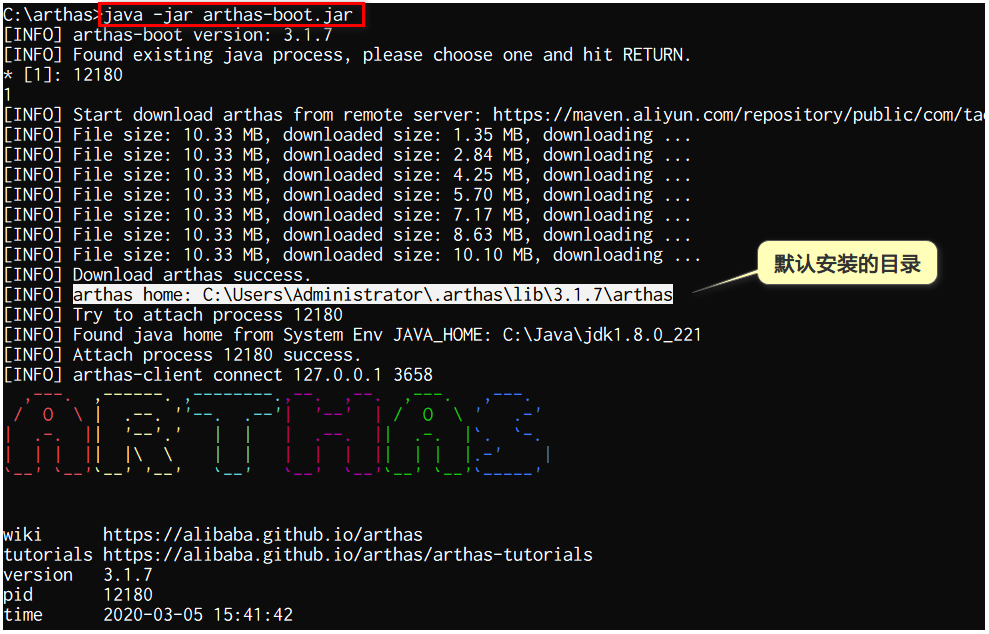

3. 查看安装好的目录

   ```
   C:\Users\Administrator\.arthas\lib\3.1.7\arthas\
   ```

   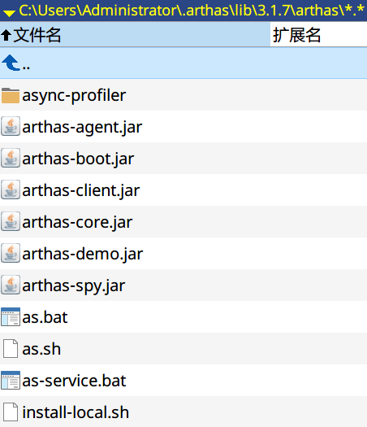 

## 小结

1. 下载arthas-boot.jar包
2. 执行arthas-boo.jar包，前提是必须要有java进程在运行。第一次执行这个jar包，会自动从服务器上下载arthas，大小是11M


# 从Maven仓库下载全量包

如果下载速度比较慢，可以尝试用[阿里云的镜像仓库](https://maven.aliyun.com/)

## 步骤

1. 比如要下载`3.1.7`版本，下载的url是：

https://maven.aliyun.com/repository/public/com/taobao/arthas/arthas-packaging/3.1.7/arthas-packaging-3.1.7-bin.zip

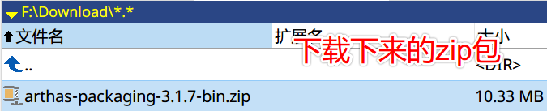 

2. 解压后，在文件夹里有`arthas-boot.jar`，直接用`java -jar`的方式启动：

```
java -jar arthas-boot.jar
```


注：如果是Linux，可以使用以下命令解压到指定的arthas目录

```
unzip -d arthas arthas-packaging-3.1.7-bin.zip
```

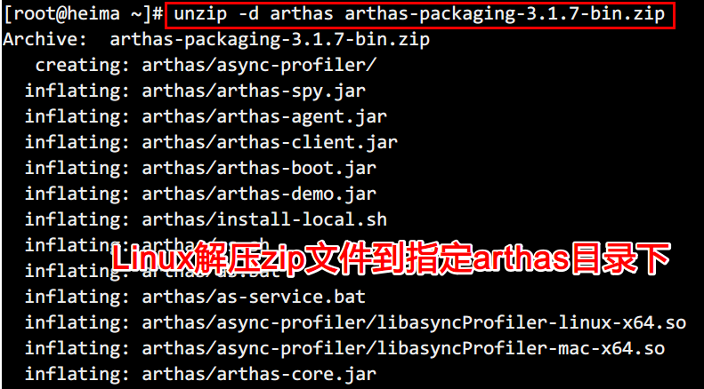 

## 小结

1. 在Linux下在线安装的方式与在Windows下的安装相同
2. 如果要使用离线的安装方式，先下载完成的zip到本地，再解压到任意的目录即可


## 卸载

### 在 Linux/Unix/Mac 平台

删除下面文件：

```
rm -rf ~/.arthas/
rm -rf ~/logs/arthas
```

### Windows平台

直接删除user home下面的`.arthas`和`logs/arthas`目录

1. 安装主目录

   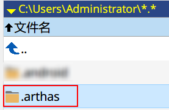 

2. 日志记录目录

   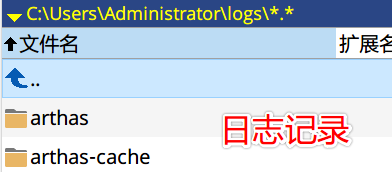 

## 小结

因为jar包是绿色，要卸载的话，直接删除2个目录

```
.arthas安装目录
logs的日志记录目录
```


# 快速入门：attach一个进程

## 目标：通过案例快速入门

1. 执行一个jar包
2. 通过arthas来attach粘附

## 步骤

### 1. 准备代码

以下是一个简单的Java程序，每隔一秒生成一个随机数，再执行质因数分解，并打印出分解结果。代码的内容不用理会这不是现在关注的点。

```java
package demo;

import java.util.ArrayList;
import java.util.List;
import java.util.Random;
import java.util.concurrent.TimeUnit;

public class MathGame {
    private static Random random = new Random();
		
    //用于统计生成的不合法变量的个数
    public int illegalArgumentCount = 0;

    public static void main(String[] args) throws InterruptedException {
        MathGame game = new MathGame();
        //死循环，每过1秒调用1次下面的方法(不是开启一个线程)
        while (true) {
            game.run();
            TimeUnit.SECONDS.sleep(1);
        }
    }

    //分解质因数
    public void run() throws InterruptedException {
        try {
            //随机生成一个整数，有可能正，有可能负
            int number = random.nextInt()/10000;
            //调用方法进行质因数分解
            List<Integer> primeFactors = primeFactors(number);
            //打印结果
            print(number, primeFactors);
        } catch (Exception e) {
            System.out.println(String.format("illegalArgumentCount:%3d, ", illegalArgumentCount) + e.getMessage());
        }
    }
    
    //打印质因数分解的结果
    public static void print(int number, List<Integer> primeFactors) {
        StringBuffer sb = new StringBuffer(number + "=");
        for (int factor : primeFactors) {
            sb.append(factor).append('*');
        }
        if (sb.charAt(sb.length() - 1) == '*') {
            sb.deleteCharAt(sb.length() - 1);
        }
        System.out.println(sb);
    }

    //计算number的质因数分解
    public List<Integer> primeFactors(int number) {
        //如果小于2，则抛出异常，并且计数加1
        if (number < 2) {
            illegalArgumentCount++;
            throw new IllegalArgumentException("number is: " + number + ", need >= 2");
        }
			 //用于保存每个质数
        List<Integer> result = new ArrayList<Integer>();
        //分解过程，从2开始看能不能整除
        int i = 2;
        while (i <= number) {  //如果i大于number就退出循环
            //能整除，则i为一个因数，number为整除的结果再继续从2开始除
            if (number % i == 0) {
                result.add(i);
                number = number / i;
                i = 2;
            } else {
                i++;  //否则i++
            }
        }

        return result;
    }
}
```

### 2. 启动Demo

#### 命令

```
下载已经打包好的arthas-demo.jar
curl -O https://alibaba.github.io/arthas/arthas-demo.jar

在命令行下执行
java -jar arthas-demo.jar
```

#### 效果

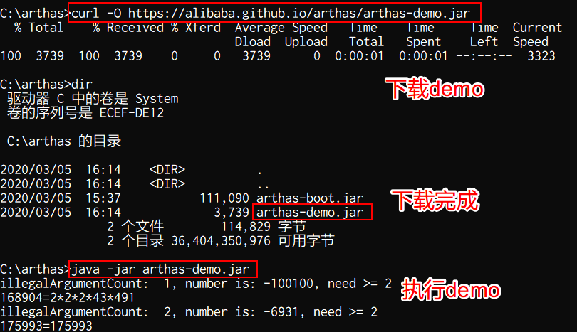  


### 3. 启动arthas

1. 因为arthas-demo.jar进程打开了一个窗口，所以另开一个命令窗口执行arthas-boot.jar
2. 选择要粘附的进程：arthas-demo.jar

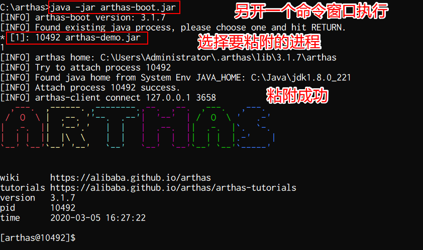 

3. 如果粘附成功，在arthas-demo.jar那个窗口中会出现日志记录的信息，记录在c:\Users\Administrator\logs目录下

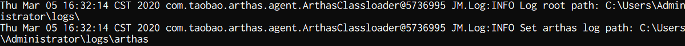


4. 如果端口号被占用，也可以通过以下命令换成另一个端口号执行

```
java -jar arthas-boot.jar --telnet-port 9998 --http-port -1
```


### 4. 通过浏览器连接arthas

Arthas目前支持Web Console，用户在attach成功之后，可以直接访问：http://127.0.0.1:3658/。

可以填入IP，远程连接其它机器上的arthas。

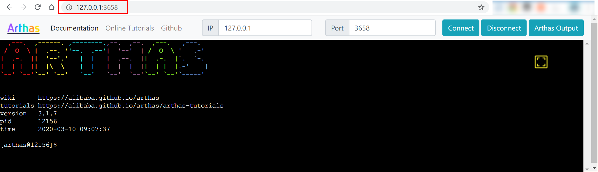

默认情况下，arthas只listen 127.0.0.1，所以如果想从远程连接，则可以使用 `--target-ip`参数指定listen的IP

## 小结

1. 启动被诊断进程
2. 启动arthas-boot.jar，粘贴上面的进程
3. 不但可以通过命令行的方式来操作arthas也可以通过浏览器来访问arthas


# 快速入门：常用命令接触

## 目标

1. dashboard仪表板
2. 通过thread命令来获取到`arthas-demo`进程的Main Class
3. 通过jad来反编译Main Class
4. watch

## 命令介绍

### 1. dashboard仪表板

输入dashboard(仪表板)，按`回车/enter`，会展示当前进程的信息，按`ctrl+c`可以中断执行。

注：输入前面部分字母，按tab可以自动补全命令

1. 第一部分是显示JVM中运行的所有线程：所在线程组，优先级，线程的状态，CPU的占用率，是否是后台进程等
2. 第二部分显示的JVM内存的使用情况
3. 第三部分是操作系统的一些信息和Java版本号

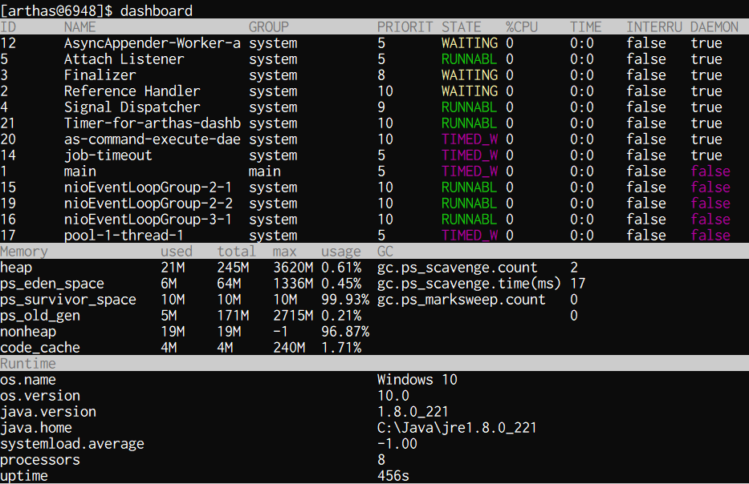


### 2. 通过thread命令来获取到`arthas-demo`进程的Main Class

获取到arthas-demo进程的Main Class

`thread 1`会打印线程ID 1的栈，通常是main函数的线程。

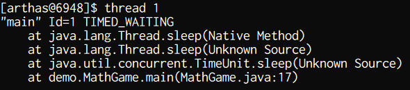 


### 3. 通过jad来反编译Main Class

```
jad demo.MathGame
```

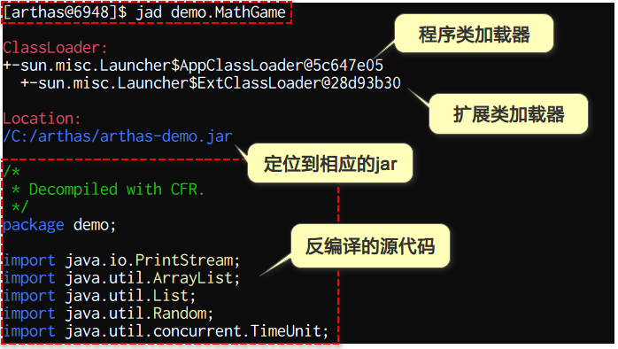 


### 4. watch监视

通过watch命令来查看`demo.MathGame#primeFactors`函数的返回值：

```
$ watch demo.MathGame primeFactors returnObj
```

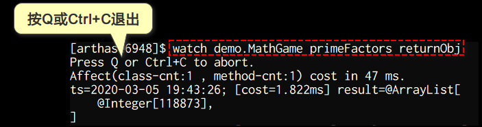 


### 5. 退出arthas

如果只是退出当前的连接，可以用`quit`或者`exit`命令。Attach到目标进程上的arthas还会继续运行，端口会保持开放，下次连接时可以直接连接上。

如果想完全退出arthas，可以执行`stop`命令。


## 小结

1. 如何启动arthas?

   ```
   java -jar arthas-boot.jar
   ```

   

2. 说说以下命令的作用

| 命令              | 功能                                 |
| ----------------- | ------------------------------------ |
| dashboard         | 显示JVM中内存的情况，JVM中环境信息   |
| thread            | 显示当前进程所有线程信息             |
| jad               | 反编译指定的类或方法                 |
| watch             | 监视某个方法的执行情况，监视了返回值 |
| quit，exit,  stop | 退出或停止arthas                     |


# 基础命令之一

## 目标

1. help
2. cat
3. grep
4. pwd
5. cls

## help

### 作用

查看命令帮助信息

### 效果

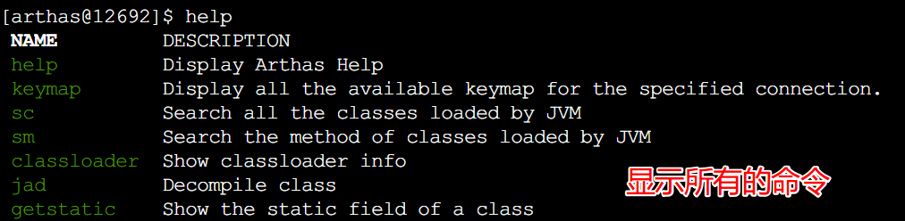


## cat

### 作用

打印文件内容，和linux里的cat命令类似

如果没有写路径，则显示当前目录下的文件

### 效果

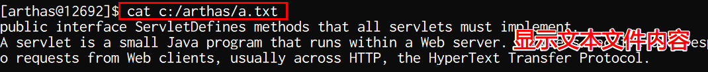


## grep

### 作用

匹配查找，和linux里的grep命令类似，但它只能用于管道命令

### 语法

| 参数列表        | 作用                                 |
| --------------- | ------------------------------------ |
| -n              | 显示行号                             |
| -i              | 忽略大小写查找                       |
| -m 行数         | 最大显示行数，要与查询字符串一起使用 |
| -e "正则表达式" | 使用正则表达式查找                   |

### 举例

```
只显示包含java字符串的行系统属性
sysprop | grep java
```
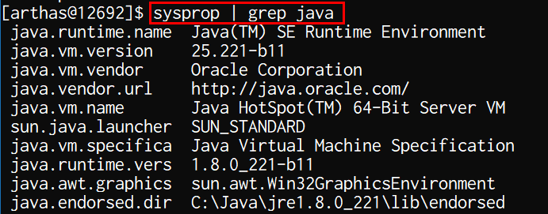 

```
显示包含java字符串的行和行号的系统属性
sysprop | grep java -n
```

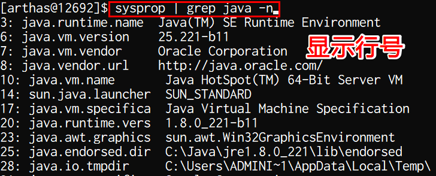 

```
显示包含system字符串的10行信息
thread | grep system -m 10
```

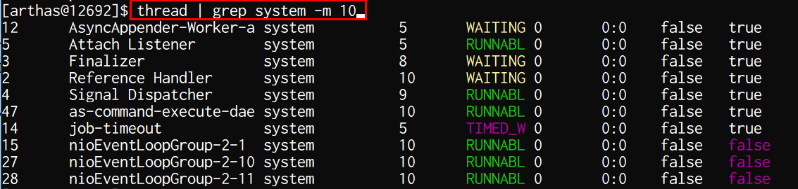 

```
使用正则表达式，显示包含2个o字符的线程信息
thread | grep -e "o+"
```

 


## pwd

### 作用

返回当前的工作目录，和linux命令类似

pwd: Print Work Directory 打印当前工作目录

### 效果

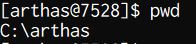 


## cls

### 作用

清空当前屏幕区域

## 小结

| 基础命令 | 作用 |
| -------- | ---- |
|          |      |
|          |      |
|          |      |
|          |      |
|          |      |


# 基础命令之二

## 目标

1. session
2. reset
3. version
4. quit
5. stop
6. keymap

## session

### 作用

查看当前会话的信息

### 效果

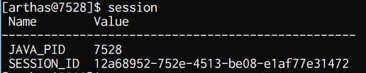 


## reset

### 作用

重置增强类，将被 Arthas 增强过的类全部还原，Arthas 服务端关闭时会重置所有增强过的类

### 语法

```
还原指定类
reset Test

还原所有以List结尾的类
reset *List

还原所有的类
reset
```

### 效果

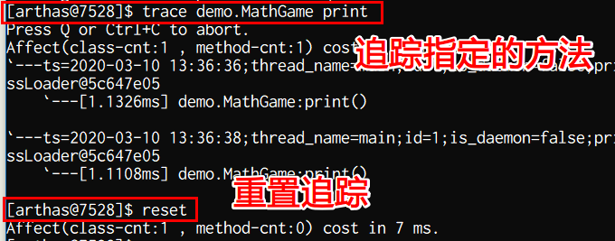 


## version

### 作用

输出当前目标 Java 进程所加载的 Arthas 版本号

### 效果

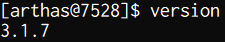 


### history

### 作用

打印命令历史

### 效果

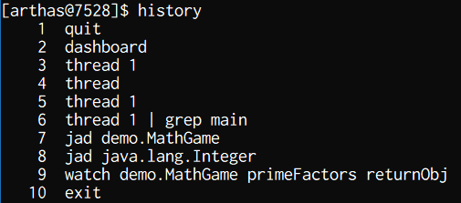 


## quit

### 作用

退出当前 Arthas 客户端，其他 Arthas 客户端不受影响


## stop

### 作用

关闭 Arthas 服务端，所有 Arthas 客户端全部退出

### 效果

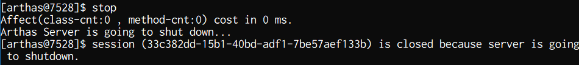


## keymap

### 作用

Arthas快捷键列表及自定义快捷键

### 效果

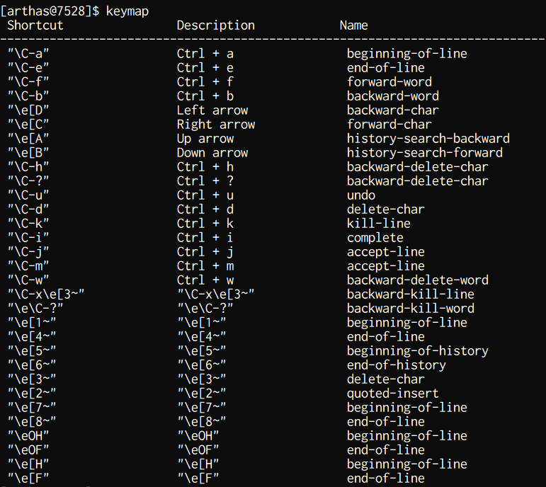 


### Arthas 命令行快捷键

| 快捷键说明       | 命令说明                         |
| ---------------- | -------------------------------- |
| ctrl + a         | 跳到行首                         |
| ctrl + e         | 跳到行尾                         |
| ctrl + f         | 向前移动一个单词                 |
| ctrl + b         | 向后移动一个单词                 |
| 键盘左方向键     | 光标向前移动一个字符             |
| 键盘右方向键     | 光标向后移动一个字符             |
| 键盘下方向键     | 下翻显示下一个命令               |
| 键盘上方向键     | 上翻显示上一个命令               |
| ctrl + h         | 向后删除一个字符                 |
| ctrl + shift + / | 向后删除一个字符                 |
| ctrl + u         | 撤销上一个命令，相当于清空当前行 |
| ctrl + d         | 删除当前光标所在字符             |
| ctrl + k         | 删除当前光标到行尾的所有字符     |
| ctrl + i         | 自动补全，相当于敲`TAB`          |
| ctrl + j         | 结束当前行，相当于敲回车         |
| ctrl + m         | 结束当前行，相当于敲回车         |

- 任何时候 `tab` 键，会根据当前的输入给出提示
- 命令后敲 `-` 或 `--` ，然后按 `tab` 键，可以展示出此命令具体的选项

## 后台异步命令相关快捷键

- ctrl + c: 终止当前命令
- ctrl + z: 挂起当前命令，后续可以 bg/fg 重新支持此命令，或 kill 掉
- ctrl + a: 回到行首
- ctrl + e: 回到行尾

## 小结

| 命令    | 说明                                             |
| ------- | ------------------------------------------------ |
| session | 显示当前会话的信息：进程的ID，会话ID             |
| reset   | 重置类的增强，服务器关闭的时候会自动重置所有的类 |
| version | 显示arthas版本号                                 |
| quit    | 退出当前会话，不会影响其它的会话                 |
| stop    | 退出arthas服务器，所有的会话都停止               |
| keymap  | 获取快捷键                                       |


# jvm相关命令之一

## 目标

1. dashboard 仪表板
2. thread 线程相关
3. jvm 虚拟机相关
4. sysprop 系统属性相关

## dashboard

### 作用

显示当前系统的实时数据面板，按q或ctrl+c退出

### 效果

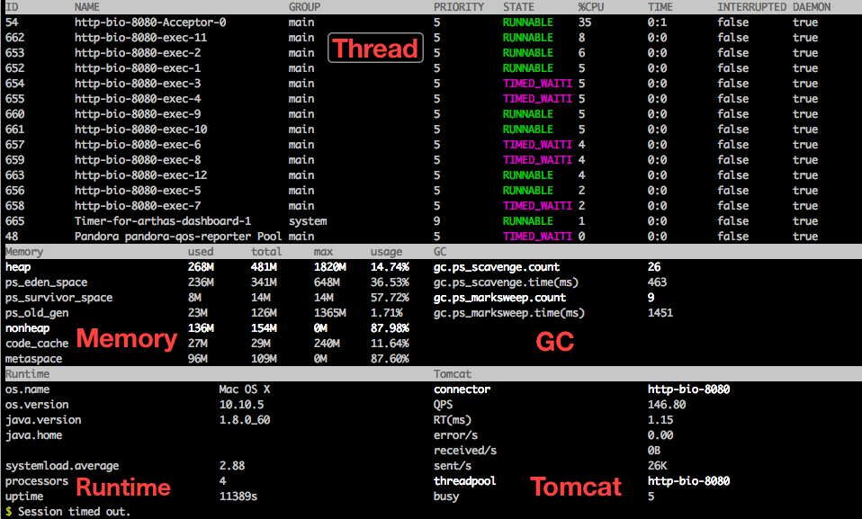

### 数据说明

- ID: Java级别的线程ID，注意这个ID不能跟jstack中的nativeID一一对应
- NAME: 线程名
- GROUP: 线程组名
- PRIORITY: 线程优先级, 1~10之间的数字，越大表示优先级越高
- STATE: 线程的状态
- CPU%: 线程消耗的cpu占比，采样100ms，将所有线程在这100ms内的cpu使用量求和，再算出每个线程的cpu使用占比。
- TIME: 线程运行总时间，数据格式为`分：秒`
- INTERRUPTED: 线程当前的中断位状态
- DAEMON: 是否是daemon线程


## thread线程相关

### 作用

查看当前 JVM 的线程堆栈信息

### 参数说明

| 参数名称     | 参数说明                              |
| ------------ | ------------------------------------- |
| 数字         | 线程id                                |
| [n:]         | 指定最忙的前N个线程并打印堆栈         |
| [b]          | 找出当前阻塞其他线程的线程            |
| [i \<value>] | 指定cpu占比统计的采样间隔，单位为毫秒 |

### 举例

```
展示当前最忙的前3个线程并打印堆栈
thread -n 3
```

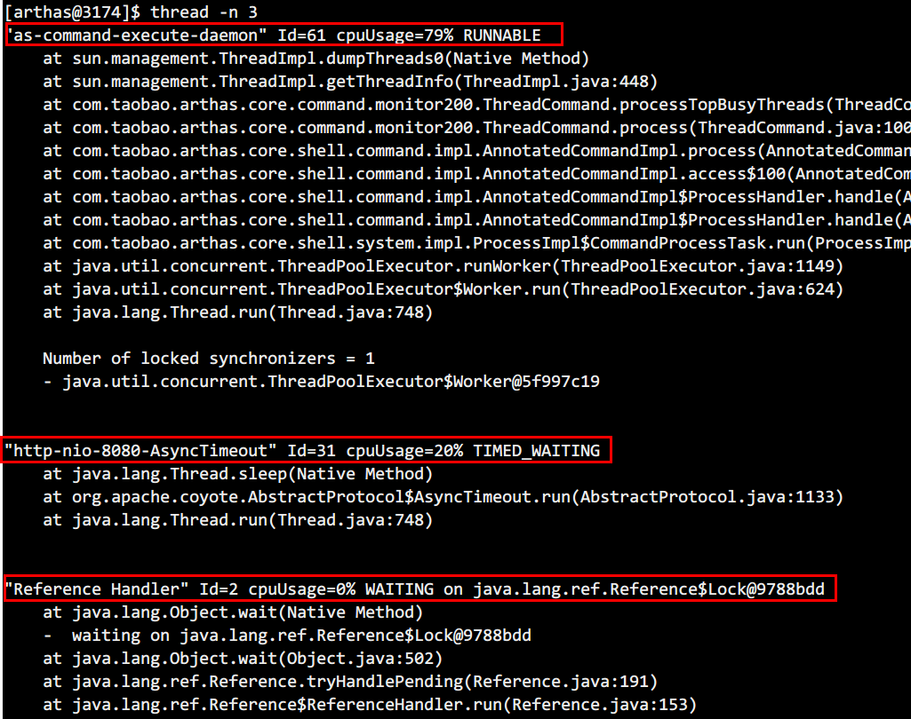 

```
当没有参数时，显示所有线程的信息
thread
```

```
显示1号线程的运行堆栈
thread 1
```

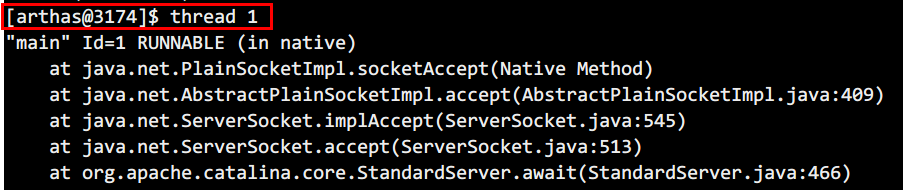 

```
找出当前阻塞其他线程的线程，有时候我们发现应用卡住了， 通常是由于某个线程拿住了某个锁， 并且其他线程都在等待这把锁造成的。 为了排查这类问题， arthas提供了thread -b， 一键找出那个罪魁祸首。
thread -b
```

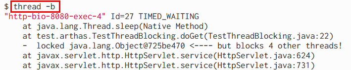 

```
指定采样时间间隔，每过1000毫秒采样，显示最占时间的3个线程
thread -i 1000 -n 3
```

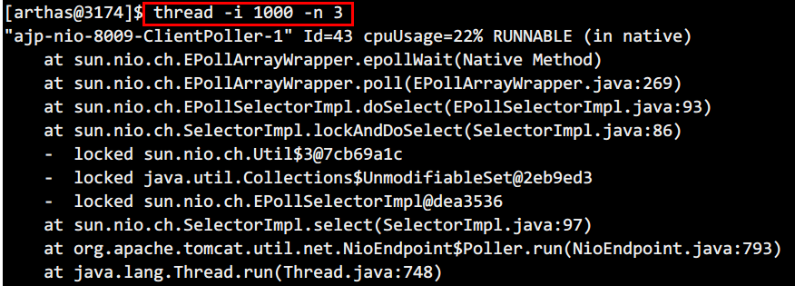 

```
查看处于等待状态的线程
thread --state WAITING
```

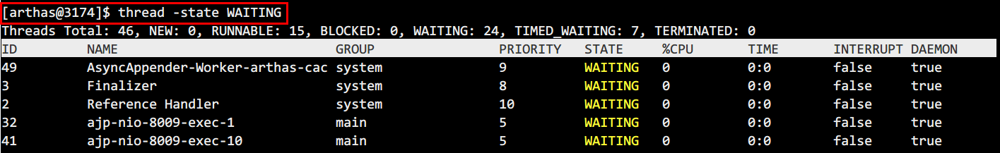 


## jvm

### 作用

查看当前 JVM 的信息

### 效果

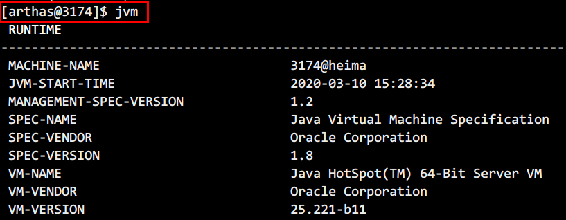 

### THREAD相关

- COUNT: JVM当前活跃的线程数
- DAEMON-COUNT: JVM当前活跃的守护线程数
- PEAK-COUNT: 从JVM启动开始曾经活着的最大线程数
- STARTED-COUNT: 从JVM启动开始总共启动过的线程次数
- DEADLOCK-COUNT: JVM当前死锁的线程数

### 文件描述符相关

- MAX-FILE-DESCRIPTOR-COUNT：JVM进程最大可以打开的文件描述符数
- OPEN-FILE-DESCRIPTOR-COUNT：JVM当前打开的文件描述符数


## sysprop

### 作用

查看和修改JVM的系统属性

### 举例

```
查看所有属性
sysprop

查看单个属性，支持通过tab补全
sysprop java.version
```

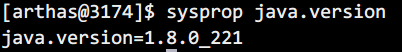 

```
修改单个属性
sysprop user.country
user.country=US

sysprop user.country CN
Successfully changed the system property.
user.country=CN
```

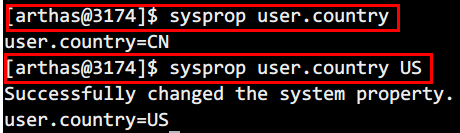 


## 小结

| jvm相关命令 | 说明                                 |
| ----------- | ------------------------------------ |
| dashboard   | 显示线程，内存，GC，系统环境等信息   |
| thread      | 显示线程信息                         |
| jvm         | 与JVM相关的信息                      |
| sysprop     | 显示系统属性信息，也可以修改某个属性 |


# jvm相关命令之二

## 目标

1. sysenv
2. vmoption
3. getstatic
4. ognl

## sysenv

### 作用

查看当前JVM的环境属性(`System Environment Variables`)

### 举例

```
查看所有环境变量
sysenv

查看单个环境变量
sysenv USER
```

### 效果

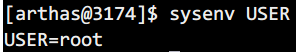 


## vmoption

### 作用

查看，更新VM诊断相关的参数

### 举例

```
查看所有的选项
vmoption

查看指定的选项
vmoption PrintGCDetails
```

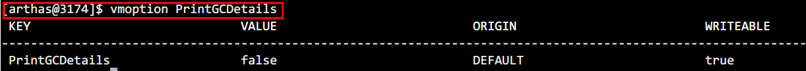 

```
更新指定的选项
vmoption PrintGCDetails true
```

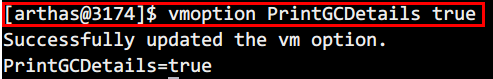 


## getstatic

### 作用

通过getstatic命令可以方便的查看类的静态属性

### 语法

```
getstatic 类名 属性名
```

### 举例

```
显示demo.MathGame类中静态属性random
getstatic demo.MathGame random
```

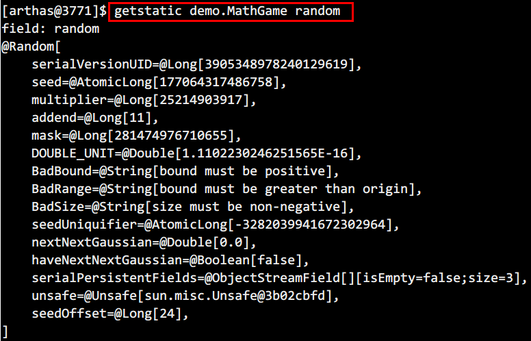  


## ognl

### 作用

执行ognl表达式，这是从3.0.5版本新增的功能

### OGNL语法

```
http://commons.apache.org/proper/commons-ognl/language-guide.html
```

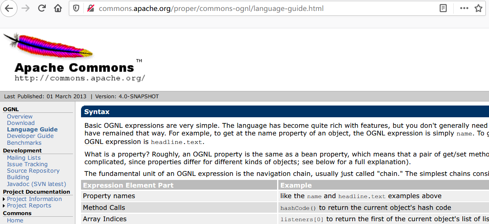

### 参数说明

| 参数名称  | 参数说明                                                     |
| --------- | ------------------------------------------------------------ |
| *express* | 执行的表达式                                                 |
| `[c:]`    | 执行表达式的 ClassLoader 的 hashcode，默认值是SystemClassLoader |
| [x]       | 结果对象的展开层次，默认值1                                  |

### 举例

```
调用静态函数
ognl '@java.lang.System@out.println("hello")'

获取静态类的静态字段
ognl '@demo.MathGame@random'

执行多行表达式，赋值给临时变量，返回一个List
ognl '#value1=@System@getProperty("java.home"), #value2=@System@getProperty("java.runtime.name"), {#value1, #value2}'
```

### 效果

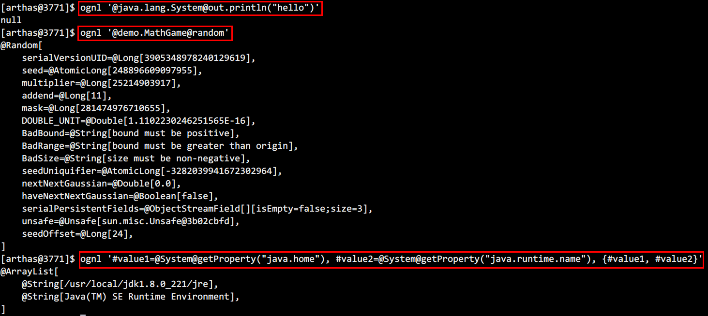


## 小结

| jvm相关命令 | 说明                    |
| ----------- | ----------------------- |
| sysenv      | 查看JVM环境变量的值     |
| vmoption    | 查看JVM中选项，可以修改 |
| getstatic   | 获取静态成员变量        |
| ognl        | 执行一个ognl表达式      |


# class/classloader相关命令之一

## 目标

1. sc: Search Class
2. sm: Search Method

## sc

### 作用

查看JVM已加载的类信息，“Search-Class” 的简写，这个命令能搜索出所有已经加载到 JVM 中的 Class 信息

sc 默认开启了子类匹配功能，也就是说所有当前类的子类也会被搜索出来，想要精确的匹配，请打开`options disable-sub-class true`开关

### 参数说明

| 参数名称         | 参数说明                                                     |
| ---------------- | ------------------------------------------------------------ |
| *class-pattern*  | 类名表达式匹配，支持全限定名，如com.taobao.test.AAA，也支持com/taobao/test/AAA这样的格式，这样，我们从异常堆栈里面把类名拷贝过来的时候，不需要在手动把`/`替换为`.`啦。 |
| *method-pattern* | 方法名表达式匹配                                             |
| [d]              | 输出当前类的详细信息，包括这个类所加载的原始文件来源、类的声明、加载的ClassLoader等详细信息。 如果一个类被多个ClassLoader所加载，则会出现多次 |
| [E]              | 开启正则表达式匹配，默认为通配符匹配                         |
| [f]              | 输出当前类的成员变量信息（需要配合参数-d一起使用）           |

### 举例

```
模糊搜索，demo包下所有的类
sc demo.*

打印类的详细信息
sc -d demo.MathGame
```

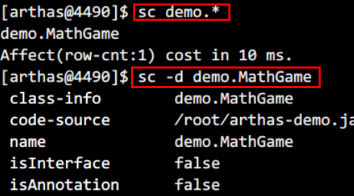 

```
打印出类的Field信息
sc -df demo.MathGame
```

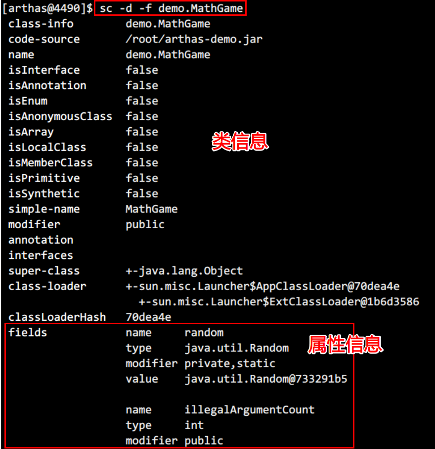 


## sm

### 作用

查看已加载类的方法信息

“Search-Method” 的简写，这个命令能搜索出所有已经加载了 Class 信息的方法信息。

`sm` 命令只能看到由当前类所声明 (declaring) 的方法，父类则无法看到。

### 参数说明

| 参数名称         | 参数说明                             |
| ---------------- | ------------------------------------ |
| *class-pattern*  | 类名表达式匹配                       |
| *method-pattern* | 方法名表达式匹配                     |
| [d]              | 展示每个方法的详细信息               |
| [E]              | 开启正则表达式匹配，默认为通配符匹配 |

### 举例

```
显示String类加载的方法
sm java.lang.String
```

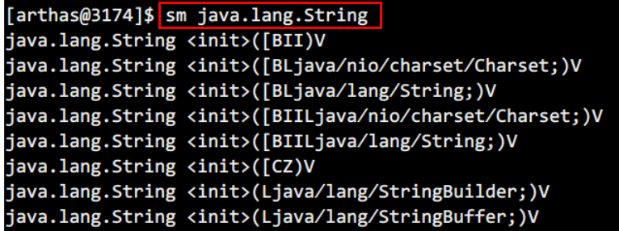 

```
显示String中的toString方法详细信息
sm -d java.lang.String toString
```

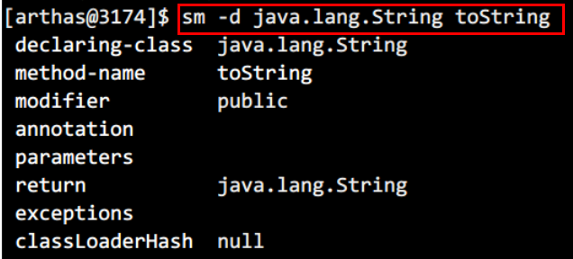 


## 小结

| 与类相关的命令 | 说明                             |
| -------------- | -------------------------------- |
| sc             | Search Class 显示类相关的信息    |
| sm             | Search Method 显示方法相关的信息 |


# class/classloader相关命令之二

## 目标

1. jad 把字节码文件反编译成源代码
2. mc 在内存中把源代码编译成字节码文件
3. redefine 把新生成的字节码文件在内存中执行

## jad

### 作用

反编译指定已加载类源码

> `jad` 命令将 JVM 中实际运行的 class 的 byte code 反编译成 java 代码，便于你理解业务逻辑；
>
> 在 Arthas Console 上，反编译出来的源码是带语法高亮的，阅读更方便
>
> 当然，反编译出来的 java 代码可能会存在语法错误，但不影响你进行阅读理解

### 参数说明

| 参数名称        | 参数说明                             |
| --------------- | ------------------------------------ |
| *class-pattern* | 类名表达式匹配                       |
| [E]             | 开启正则表达式匹配，默认为通配符匹配 |

### 举例

```
编译java.lang.String
jad java.lang.String
```

```
反编绎时只显示源代码，默认情况下，反编译结果里会带有ClassLoader信息，通过--source-only选项，可以只打印源代码。方便和mc/redefine命令结合使用。
jad --source-only demo.MathGame
```

 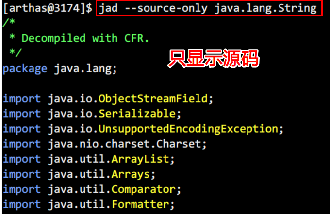 

```
反编译指定的函数
jad demo.MathGame main
```

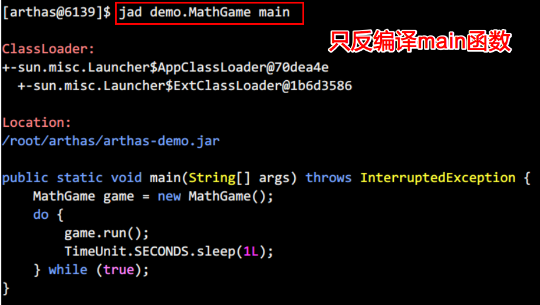 


## mc

### 作用

Memory Compiler/内存编译器，编译`.java`文件生成`.class`

### 举例

```
在内存中编译Hello.java为Hello.class
mc /root/Hello.java

可以通过-d命令指定输出目录
mc -d /root/bbb /root/Hello.java
```

### 效果

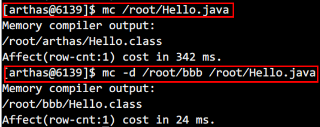 


## redefine

### 作用

加载外部的`.class`文件，redefine到JVM里

> 注意， redefine后的原来的类不能恢复，redefine有可能失败（比如增加了新的field）。

> `reset`命令对`redefine`的类无效。如果想重置，需要`redefine`原始的字节码。

> `redefine`命令和`jad`/`watch`/`trace`/`monitor`/`tt`等命令会冲突。执行完`redefine`之后，如果再执行上面提到的命令，则会把`redefine`的字节码重置。

### redefine的限制

- 不允许新增加field/method
- 正在跑的函数，没有退出不能生效，比如下面新增加的`System.out.println`，只有`run()`函数里的会生效

```java
public class MathGame {

    public static void main(String[] args) throws InterruptedException {
        MathGame game = new MathGame();
        while (true) {
            game.run();
            TimeUnit.SECONDS.sleep(1);
            // 这个不生效，因为代码一直跑在 while里
            System.out.println("in loop");
        }
    }

    public void run() throws InterruptedException {
        // 这个生效，因为run()函数每次都可以完整结束
        System.out.println("call run()");
        try {
            int number = random.nextInt();
            List<Integer> primeFactors = primeFactors(number);
            print(number, primeFactors);
        } catch (Exception e) {
            System.out.println(String.format("illegalArgumentCount:%3d, ", illegalArgumentCount) + e.getMessage());
        }
    }
	
}
```

### 案例：结合 jad/mc 命令使用

#### 步骤

```
1. 使用jad反编译demo.MathGame输出到/root/MathGame.java
jad --source-only demo.MathGame > /root/MathGame.java
```

```
2.按上面的代码编辑完毕以后，使用mc内存中对新的代码编译
mc /root/MathGame.java -d /root
```

```
3.使用redefine命令加载新的字节码
redefine /root/demo/MathGame.class
```

#### 结果

 

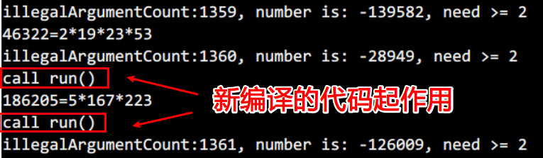 

## 小结

| 类相关的命令 | 说明                             |
| ------------ | -------------------------------- |
| jad          | 反编译字节码文件得到java的源代码 |
| mc           | 在内存中将源代码编译成字节码     |
| redefine     | 将字节码文件重新加载到内存中执行 |

# 学习总结

1. 安装arthas的方法

   既可以安装在windows下也可以安装在Linux

   1. 在线安装

   ```
   curl -O https://alibaba.github.io/arthas/arthas-boot.jar
   java -jar arthas-boot.jar
   ```

   2. 离线安装

      将从maven仓库中下载的zip包直接解压就可以使用

   3. 卸载方式

      直接删除2个文件夹：.arthas和logs

   

2. 基础命令

   | 基础命令 | 功能                                                         |
   | -------- | ------------------------------------------------------------ |
   | help     | 显示所有arthas命令，每个命令都可以使用-h的参数，显示它的参数信息 |
   | cat      | 显示文本文件内容                                             |
   | grep     | 对内容进行过滤，只显示关心的行                               |
   | pwd      | 显示当前的工作路径                                           |
   | cls      | 清除屏幕                                                     |
   | session  | 显示当前连接的会话ID                                         |
   | reset    | 重置arthas增强的类                                           |
   | version  | 显示当前arthas的版本号                                       |
   | quit     | 退出当前的会话                                               |
   | stop     | 结束arthas服务器，退出所有的会话                             |
   | keymap   | 显示所有的快捷键                                             |

   

3. jvm相关命令

   | jvm相关命令 | 说明                                                  |
   | ----------- | ----------------------------------------------------- |
   | dashboard   | 仪表板，可以显示：线程，内存，堆栈，GC，Runtime等信息 |
   | thread      | 显示线程的堆栈                                        |
   | jvm         | 显示java虚拟机信息                                    |
   | sysprop     | 显示jvm中系统属性，也可以修改某个属性                 |
   | sysenv      | 显示jvm中系统环境变量配置信息                         |
   | vmoption    | 显示jvm中选项信息                                     |
   | getstatic   | 获取类中静态成员变量                                  |
   | ognl        | 执行一条ognl表达式，对象图导航语言                    |

   

4. class和classloader相关命令

   | 类，类加载相关的命令 | 说明                                |
   | -------------------- | ----------------------------------- |
   | sc                   | Search Class 查看运行中的类信息     |
   | sm                   | Search Method 查看类中方法的信息    |
   | jad                  | 反编译字节码为源代码                |
   | mc                   | Memory Compile 将源代码编译成字节码 |
   | redefine             | 将编译好的字节码文件加载到jvm中运行 |

   