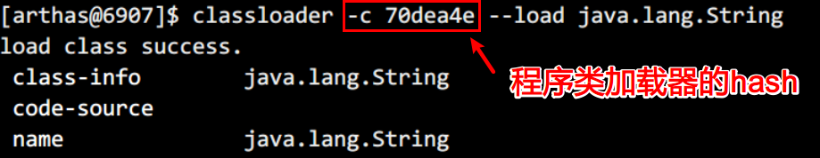
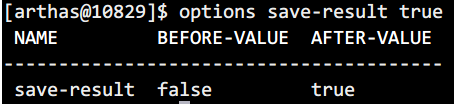

# 《Arthas进阶》

# 学习目标

1. 类和类加载器相关的命令
2. monitor/watch/trace/stack等核心命令的使用
3. 火焰图的生成
4. Arthas实战案例

# dump

## 作用

将已加载类的字节码文件保存到特定目录：logs/arthas/classdump/

### 参数

| 数名称          | 参数说明                             |
| --------------- | ------------------------------------ |
| *class-pattern* | 类名表达式匹配                       |
| `[c:]`          | 类所属 ClassLoader 的 hashcode       |
| [E]             | 开启正则表达式匹配，默认为通配符匹配 |

## 举例

```
把String类的字节码文件保存到~/logs/arthas/classdump/目录下
dump java.lang.String
```

```
把demo包下所有的类的字节码文件保存到~/logs/arthas/classdump/目录下
dump demo.*
```

## 效果


  


## 小结

dump作用：将正在JVM中运行的程序的字节码文件提取出来，保存在logs相应的目录下

不同的类加载器放在不同的目录下


# classloader

## 目标

获取类加载器的信息

## 作用

1. `classloader` 命令将 JVM 中所有的classloader的信息统计出来，并可以展示继承树，urls等。

2. 可以让指定的classloader去getResources，打印出所有查找到的resources的url。对于`ResourceNotFoundException`异常比较有用。

## 参数说明

| 参数名称     | 参数说明                                |
| ------------ | --------------------------------------- |
| [l]          | 按类加载实例进行统计                    |
| [t]          | 打印所有ClassLoader的继承树             |
| [a]          | 列出所有ClassLoader加载的类，请谨慎使用 |
| `[c:]`       | ClassLoader的hashcode                   |
| `[c: r:]`    | 用ClassLoader去查找resource             |
| `[c: load:]` | 用ClassLoader去加载指定的类             |

## 举例

```
默认按类加载器的类型查看统计信息
classloader
```

 

```
按类加载器的实例查看统计信息，可以看到类加载的hashCode
classloader -l
```

 

```
查看ClassLoader的继承树
classloader -t
```

 

```
通过类加载器的hash，查看此类加载器实际所在的位置
classloader -c 680f2737
```

 

```
使用ClassLoader去查找指定资源resource所在的位置
classloader -c 680f2737 -r META-INF/MANIFEST.MF
```

 

```
使用ClassLoader去查找类的class文件所在的位置
classloader -c 680f2737 -r java/lang/String.class
```

 

```
使用ClassLoader去加载类
classloader -c 70dea4e --load java.lang.String
```

 

## 小结

classloader命令主要作用有哪些？

1. 显示所有类加载器的信息
2. 获取某个类加载器所在的jar包
3. 获取某个资源在哪个jar包中
4. 加载某个类


# monitor

## 目标

monitor命令：监控指定类中方法的执行情况

## 作用

> 对匹配 `class-pattern`／`method-pattern`的类、方法的调用进行监控。
>
> `monitor` 命令是一个非实时返回命令，实时返回命令是输入之后立即返回
>
> 而非实时返回的命令，则是不断的等待目标 Java 进程返回信息，直到用户输入 `Ctrl+C` 为止。

## 参数说明

方法拥有一个命名参数 `[c:]`，意思是统计周期（cycle of output），拥有一个整型的参数值

| 参数名称         | 参数说明                             |
| ---------------- | ------------------------------------ |
| *class-pattern*  | 类名表达式匹配                       |
| *method-pattern* | 方法名表达式匹配                     |
| [E]              | 开启正则表达式匹配，默认为通配符匹配 |
| `[c:]`           | 统计周期，默认值为120秒              |

## 举例

```
过5秒监控一次，类demo.MathGame中primeFactors方法
monitor -c 5 demo.MathGame primeFactors
```


## 监控的维度说明

| 监控项    | 说明                       |
| --------- | -------------------------- |
| timestamp | 时间戳                     |
| class     | Java类                     |
| method    | 方法（构造方法、普通方法） |
| total     | 调用次数                   |
| success   | 成功次数                   |
| fail      | 失败次数                   |
| rt        | 平均耗时                   |
| fail-rate | 失败率                     |

## 小结

monitor命令的作用是什么？

```
用来监视一个时间段中指定方法的执行次数，成功次数，失败次数，耗时等这些信息
```


# watch

## 目标

观察到指定方法的调用情况

## 作用

> 方法执行数据观测，让你能方便的观察到指定方法的调用情况。
>
> 能观察到的范围为：`返回值`、`抛出异常`、`入参`，通过编写OGNL 表达式进行对应变量的查看。

## 参数说明

watch 的参数比较多，主要是因为它能在 4 个不同的场景观察对象

| 参数名称            | 参数说明                                           |
| ------------------- | -------------------------------------------------- |
| *class-pattern*     | 类名表达式匹配                                     |
| *method-pattern*    | 方法名表达式匹配                                   |
| *express*           | 观察表达式                                         |
| *condition-express* | 条件表达式                                         |
| [b]                 | 在**方法调用之前**观察 before                      |
| [e]                 | 在**方法异常之后**观察 exception                   |
| [s]                 | 在**方法返回之后**观察 success                     |
| [f]                 | 在**方法结束之后**(正常返回和异常返回)观察  finish |
| [E]                 | 开启正则表达式匹配，默认为通配符匹配               |
| [x:]                | 指定输出结果的属性遍历深度，默认为 1               |

这里重点要说明的是观察表达式，观察表达式的构成主要由ognl 表达式组成，所以你可以这样写`"{params,returnObj}"`，只要是一个合法的 ognl 表达式，都能被正常支持。

### 特别说明

- watch 命令定义了4个观察事件点，即 `-b` 方法调用前，`-e` 方法异常后，`-s` 方法返回后，`-f` 方法结束后
- 4个观察事件点 `-b`、`-e`、`-s` 默认关闭，`-f` 默认打开，当指定观察点被打开后，在相应事件点会对观察表达式进行求值并输出
- 这里要注意`方法入参`和`方法出参`的区别，有可能在中间被修改导致前后不一致，除了 `-b` 事件点 `params` 代表方法入参外，其余事件都代表方法出参
- 当使用 `-b` 时，由于观察事件点是在方法调用前，此时返回值或异常均不存在

## 举例

```
观察demo.MathGame类中primeFactors方法出参和返回值，结果属性遍历深度为2。
params表示所有参数数组(因为不确定是几个参数)，returnObject表示返回值

watch demo.MathGame primeFactors "{params,returnObj}" -x 2
```

 

```
观察方法入参，对比前一个例子，返回值为空（事件点为方法执行前，因此获取不到返回值）

watch demo.MathGame primeFactors "{params,returnObj}" -x 2 -b
```

 


```
观察当前对象中的属性，如果想查看方法运行前后，当前对象中的属性，可以使用target关键字，代表当前对象
watch demo.MathGame primeFactors 'target' -x 2
```

 


```
同时观察方法调用前和方法返回后，参数里-n 2，表示只执行两次。
这里输出结果中，第一次输出的是方法调用前的观察表达式的结果，第二次输出的是方法返回后的表达式的结果
params表示参数，target表示执行方法的对象，returnObject表示返回值

watch demo.MathGame primeFactors "{params,target,returnObj}" -x 2 -b -s -n 2
```

 

```
使用target.field_name访问当前对象的某个属性
watch demo.MathGame primeFactors 'target.illegalArgumentCount'
```

 

```
条件表达式的例子，输出第1参数小于的情况
watch demo.MathGame primeFactors "{params[0],target}" "params[0]<0"
```

 

## 小结

| 参数名称 | 参数说明                              |
| -------- | ------------------------------------- |
| [b]      | begin 监视方法执行前的情况            |
| [e]      | exception 监视出现异常的情况          |
| [s]      | success 执行成功的情况                |
| [f]      | finish 执行完毕的情况，包含成功或失败 |


# trace

## 目标

学习trace这条命令的使用

对方法内部调用路径进行追踪，并输出方法路径上的每个节点上耗时

## 介绍

> `trace` 命令能主动搜索 `class-pattern`／`method-pattern` 对应的方法调用路径，渲染和统计整个调用链路上的所有性能开销和追踪调用链路。
>
> 观察表达式的构成主要由ognl 表达式组成，所以你可以这样写`"{params,returnObj}"`，只要是一个合法的 ognl 表达式，都能被正常支持。
>
> 很多时候我们只想看到某个方法的rt大于某个时间之后的trace结果，现在Arthas可以按照方法执行的耗时来进行过滤了，例如`trace *StringUtils isBlank '#cost>100'`表示当执行时间超过100ms的时候，才会输出trace的结果。
>
> watch/stack/trace这个三个命令都支持`#cost`耗时条件过滤

## 参数说明

| 参数名称            | 参数说明                             |
| ------------------- | ------------------------------------ |
| *class-pattern*     | 类名表达匹配                         |
| *method-pattern*    | 方法名表达式匹配                     |
| *condition-express* | 条件表达式，使用OGNL表达式           |
| [E]                 | 开启正则表达式匹配，默认是通配符匹配 |
| `[n:]`              | 设置命令执行次数                     |
| `#cost`             | 方法执行耗时，单位是毫秒             |

## 举例

```
trace函数指定类的指定方法
trace demo.MathGame run
```

 

```
如果方法调用的次数很多，那么可以用-n参数指定捕捉结果的次数。比如下面的例子里，捕捉到一次调用就退出命令。
trace demo.MathGame run -n 1
```


```
默认情况下，trace不会包含jdk里的函数调用，如果希望trace jdk里的函数，需要显式设置--skipJDKMethod false。
trace --skipJDKMethod false demo.MathGame run
```


```
据调用耗时过滤，trace大于0.5ms的调用路径
trace demo.MathGame run '#cost > .5'
```

 

```
可以用正则表匹配路径上的多个类和函数，一定程度上达到多层trace的效果。
trace -E com.test.ClassA|org.test.ClassB method1|method2|method3
```

## 小结

| 参数名称          | 参数说明                       |
| ----------------- | ------------------------------ |
| class-pattern     | 类名表达式匹配                 |
| method-pattern    | 方法名表达式匹配               |
| condition-express | 条件表达式                     |
| #cost             | 过滤条件，只追踪满足的耗时方法 |


# stack

## 作用

输出当前方法被调用的调用路径

## 介绍

> 很多时候我们都知道一个方法被执行，但这个方法被执行的路径非常多，或者你根本就不知道这个方法是从那里被执行了，此时你需要的是 stack 命令。

## 参数说明

| 参数名称            | 参数说明                             |
| ------------------- | ------------------------------------ |
| *class-pattern*     | 类名表达式匹配                       |
| *method-pattern*    | 方法名表达式匹配                     |
| *condition-express* | 条件表达式，OGNL                     |
| [E]                 | 开启正则表达式匹配，默认为通配符匹配 |
| `[n:]`              | 执行次数限制                         |

## 举例

```
获取primeFactors的调用路径
stack demo.MathGame primeFactors
```

 


```
条件表达式来过滤，第0个参数的值小于0，-n表示获取2次
stack demo.MathGame primeFactors 'params[0]<0' -n 2
```

 


```
据执行时间来过滤，耗时大于0.5毫秒
stack demo.MathGame primeFactors '#cost>0.5'
```

 

## 小结

stack命令的作用是什么？

```
输出当前方法被调用的路径
```


# tt

## 作用

time-tunnel 时间隧道

记录下指定方法每次调用的入参和返回信息，并能对这些不同时间下调用的信息进行观测

## 介绍

> `watch` 虽然很方便和灵活，但需要提前想清楚观察表达式的拼写，这对排查问题而言要求太高，因为很多时候我们并不清楚问题出自于何方，只能靠蛛丝马迹进行猜测。
>
> 这个时候如果能记录下当时方法调用的所有入参和返回值、抛出的异常会对整个问题的思考与判断非常有帮助。
>
> 于是乎，TimeTunnel 命令就诞生了。

## 参数解析

| tt的参数  | 说明                             |
| --------- | -------------------------------- |
| -t        | 记录某个方法在一个时间段中的调用 |
| -l        | 显示所有已经记录的列表           |
| -n 次数   | 只记录多少次                     |
| -s 表达式 | 搜索表达式                       |
| -i 索引号 | 查看指定索引号的详细调用信息     |
| -p        | 重新调用指定的索引号时间碎片     |

- `-t`

  tt 命令有很多个主参数，`-t` 就是其中之一。这个参数表明希望记录下类 `*Test` 的 `print` 方法的每次执行情况。

- `-n 3`

  当你执行一个调用量不高的方法时可能你还能有足够的时间用 `CTRL+C` 中断 tt 命令记录的过程，但如果遇到调用量非常大的方法，瞬间就能将你的 JVM 内存撑爆。

  此时你可以通过 `-n` 参数指定你需要记录的次数，当达到记录次数时 Arthas 会主动中断tt命令的记录过程，避免人工操作无法停止的情况。

## 使用案例

### 基本使用

```
最基本的使用来说，就是记录下当前方法的每次调用环境现场。
tt -t demo.MathGame primeFactors
```


### 表格字段说明

| 表格字段  | 字段解释                                                     |
| --------- | ------------------------------------------------------------ |
| INDEX     | 时间片段记录编号，每一个编号代表着一次调用，后续tt还有很多命令都是基于此编号指定记录操作，非常重要。 |
| TIMESTAMP | 方法执行的本机时间，记录了这个时间片段所发生的本机时间       |
| COST(ms)  | 方法执行的耗时                                               |
| IS-RET    | 方法是否以正常返回的形式结束                                 |
| IS-EXP    | 方法是否以抛异常的形式结束                                   |
| OBJECT    | 执行对象的`hashCode()`，注意，曾经有人误认为是对象在JVM中的内存地址，但很遗憾他不是。但他能帮助你简单的标记当前执行方法的类实体 |
| CLASS     | 执行的类名                                                   |
| METHOD    | 执行的方法名                                                 |

- 条件表达式

  不知道大家是否有在使用过程中遇到以下困惑

  - Arthas 似乎很难区分出重载的方法
  - 我只需要观察特定参数，但是 tt 却全部都给我记录了下来

  条件表达式也是用 `OGNL` 来编写，核心的判断对象依然是 `Advice` 对象。除了 `tt` 命令之外，`watch`、`trace`、`stack` 命令也都支持条件表达式。

- 解决方法重载

  `tt -t *Test print params.length==1`

  通过制定参数个数的形式解决不同的方法签名，如果参数个数一样，你还可以这样写

  `tt -t *Test print 'params[1] instanceof Integer'`

- 解决指定参数

  `tt -t *Test print params[0].mobile=="13989838402"`


### 检索调用记录

当你用 `tt` 记录了一大片的时间片段之后，你希望能从中筛选出自己需要的时间片段，这个时候你就需要对现有记录进行检索。

```
tt -l
```


需要筛选出 `primeFactors` 方法的调用信息

```
tt -s 'method.name=="primeFactors"'
```


### 查看调用信息

对于具体一个时间片的信息而言，你可以通过 `-i` 参数后边跟着对应的 `INDEX` 编号查看到他的详细信息。

```
tt -i 1002
```

 


### 重做一次调用

当你稍稍做了一些调整之后，你可能需要前端系统重新触发一次你的调用，此时得求爷爷告奶奶的需要前端配合联调的同学再次发起一次调用。而有些场景下，这个调用不是这么好触发的。

`tt` 命令由于保存了当时调用的所有现场信息，所以我们可以自己主动对一个 `INDEX` 编号的时间片自主发起一次调用，从而解放你的沟通成本。此时你需要 `-p` 参数。通过 `--replay-times` 指定 调用次数，通过 `--replay-interval` 指定多次调用间隔(单位ms, 默认1000ms)

```
tt -i 1002 -p
```

 

## 小结

作用：记录指定方法每次调用的入参和返回值，并后期还可以对这些信息进行观测

| tt的参数      | 说明                       |
| ------------- | -------------------------- |
| -t            | 记录方法在一个时间段中调用 |
| -l            | 显示所有已经记录的列表     |
| -n 次数       | 只记录多少次               |
| -s 搜索表达式 | 指定搜索表达式             |
| -i 索引号     | 查看它的详细信息           |


# options

## 作用

> 全局开关

## 全局选项

| 名称                | 默认值 | 描述                                                         |
| ------------------- | ------ | ------------------------------------------------------------ |
| unsafe              | false  | 是否支持对系统级别的类进行增强，打开该开关可能导致把JVM搞挂，请慎重选择！ |
| dump                | false  | 是否支持被增强了的类dump到外部文件中，如果打开开关，class文件会被dump到`/${application dir}/arthas-class-dump/`目录下，具体位置详见控制台输出 |
| batch-re-transform  | true   | 是否支持批量对匹配到的类执行retransform操作                  |
| json-format         | false  | 是否支持json化的输出                                         |
| disable-sub-class   | false  | 是否禁用子类匹配，默认在匹配目标类的时候会默认匹配到其子类，如果想精确匹配，可以关闭此开关 |
| debug-for-asm       | false  | 打印ASM相关的调试信息                                        |
| save-result         | false  | 是否打开执行结果存日志功能，打开之后所有命令的运行结果都将保存到`~/logs/arthas-cache/result.log`中 |
| job-timeout         | 1d     | 异步后台任务的默认超时时间，超过这个时间，任务自动停止；比如设置 1d, 2h, 3m, 25s，分别代表天、小时、分、秒 |
| print-parent-fields | true   | 是否打印在parent class里的filed                              |

## 案例

### 查看所有的options

```
options
```


### 获取option的值

```
options json-format
```


### 设置指定的option

例如，想打开执行结果存日志功能，输入如下命令即可：

```
options save-result true
```

 

## 小结

options的作用是：查看或设置arthas全局环境变量


# profiler火焰图

## 目标

生成火焰图

## 介绍

`profiler` 命令支持生成应用热点的火焰图。本质上是通过不断的采样，然后把收集到的采样结果生成火焰图。

命令基本运行结构是 `profiler 命令 [命令参数]`

## 案例

### 启动profiler

```
$ profiler start
Started [cpu] profiling
```

> 默认情况下，生成的是cpu的火焰图，即event为`cpu`。可以用`--event`参数来指定。

### 显示支持的事件

```
$ profiler list
```

### 获取已采集的sample的数量

```
$ profiler getSamples
23
```

### 查看profiler状态

```
$ profiler status
[cpu] profiling is running for 4 seconds
```

可以查看当前profiler在采样哪种`event`和采样时间。

### 停止profiler

#### 生成svg格式结果

```
$ profiler stop
profiler output file: /tmp/demo/arthas-output/20191125-135546.svg
OK
```

默认情况下，生成的结果保存到应用的`工作目录`下的`arthas-output`目录。可以通过 `--file`参数来指定输出结果路径。比如：

```
$ profiler stop --file /tmp/output.svg
profiler output file: /tmp/output.svg
OK
```

#### 生成html格式结果

默认情况下，结果文件是`svg`格式，如果想生成`html`格式，可以用`--format`参数指定：

```
$ profiler stop --format html
profiler output file: /tmp/test/arthas-output/20191125-143329.html
OK
```

或者在`--file`参数里用文件名指名格式。比如`--file /tmp/result.html` 。


### 通过浏览器查看arthas-output下面的profiler结果

默认情况下，arthas使用3658端口，则可以打开： http://localhost:3658/arthas-output/ 查看到`arthas-output`目录下面的profiler结果：


点击可以查看具体的结果：


## 火焰图的含义

火焰图是基于 perf 结果产生的SVG 图片，用来展示 CPU 的调用栈。

> y 轴表示调用栈，每一层都是一个函数。调用栈越深，火焰就越高，顶部就是正在执行的函数，下方都是它的父函数。
>
> x 轴表示抽样数，如果一个函数在 x 轴占据的宽度越宽，就表示它被抽到的次数多，即执行的时间长。注意，x 轴不代表时间，而是所有的调用栈合并后，按字母顺序排列的。
>
> **火焰图就是看顶层的哪个函数占据的宽度最大。只要有"平顶"（plateaus），就表示该函数可能存在性能问题。**
>
> 颜色没有特殊含义，因为火焰图表示的是 CPU 的繁忙程度，所以一般选择暖色调。


## 小结

| profiler            | 命令作用                                                     |
| ------------------- | ------------------------------------------------------------ |
| profiler start      | 启动profiler，默认情况下，生成cpu的火焰图                    |
| profiler list       | 显示所有支持的事件                                           |
| profiler getSamples | 获取已采集的sample的数量                                     |
| profiler status     | 查看profiler的状态，运行的时间                               |
| profiler stop       | 停止profiler，生成火焰图的结果，指定输出目录和输出格式：svg或html |


# Arthas实践

## 需求

### 1. 哪个Controller处理了请求

我们可以快速定位一个请求是被哪些`Filter`拦截的，或者请求最终是由哪些`Servlet`处理的。但有时，我们想知道一个请求是被哪个Spring MVC Controller处理的。如果翻代码的话，会比较难找，并且不一定准确。通过Arthas可以精确定位是哪个`Controller`处理请求。

### 2. 每个请求的调用参数和返回值是多少

通过watch来查看请求的参数和返回值

## 准备场景

将ssm_student.war项目部署到Linux的tomcat服务器下，可以正常访问。

启动之后，访问：http://192.168.254.199:8080/ssm_student ，会返回如下页面。192.168.254.199 是Linux服务器的地址。

那么这个请求是被哪个`Controller`处理的呢？

 

## 步骤

1. trace定位DispatcherServlet
2. jad反编译DispatcherServlet
3. watch定位handler
4. 使用watch得到方法的入参和返回值

## 实现步骤

第1步：

```
在浏览器上进行登录操作，检查最耗时的方法
trace *.DispatcherServlet *
```

  

```
可以分步trace，请求最终是被DispatcherServlet#doDispatch()处理了
trace *.FrameworkServlet doService
```


第2步： 

```
trace结果里把调用的行号打印出来了，我们可以直接在IDE里查看代码（也可以用jad命令反编译）
jad --source-only *.DispatcherServlet doDispatch
```


第3步：

```
watch *.DispatcherServlet getHandler 'returnObj'
查看返回的结果，得到使用到了2个控制器的方法
```


第4步：

```
watch com.itheima.controller.* * {params,returnObj} -x 2
```

 

## 结论

通过trace, jad, watch最后得到这个操作由2个控制器来处理，分别是：

```
com.itheima.controller.UserController.login()
com.itheima.controller.StudentController.findAll()
```


# 学习总结

| 命令        | 说明                                                       |
| ----------- | ---------------------------------------------------------- |
| dump        | 将已加载类的字节码文件保存到特定的目录中                   |
| classloader | 获取类加载器的信息                                         |
| monitor     | 监控指定类中方法的执行情况                                 |
| watch       | 观察到指定方法的调用情况                                   |
| trace       | 对方法内部调用路径进行追踪，并输出方法路径上每个节点上耗时 |
| stack       | 输出当前方法被调用的路径                                   |
| tt          | 记录指定方法每次调用的入参和返回信息                       |
| options     | 全局开关                                                   |
| profiler    | 生成火焰图                                                 |

